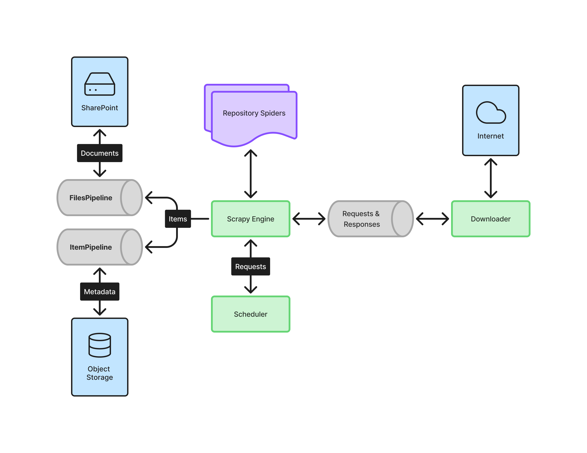

# Architecture

Open IRE is built on
[Scrapy](https://docs.scrapy.org/en/latest/topics/architecture.html) with a
modular architecture that separates data collection, processing, and storage
components. Each spider is responsible for indexing, crawling, and capturing
data from a specific source repository. This separation allows for concurrent
development and more granular deployments.

Many system behaviors can be configured through the
[Scrapy settings](https://docs.scrapy.org/en/latest/topics/settings.html) files
under `src/open_ire/settings/`.

### Settings package

The `ENVIRONMENT` environment variable (defaults to `development`) controls
which settings module is loaded. The `__init__.py` entry point reads this
variable and re-exports everything from the matching module:

- `base.py` — shared defaults for all environments
- `development.py` — overrides meant for local development
- `production.py` — overrides meant for deployed runs

> [!NOTE] Project-specific settings use the `OPEN_IRE_` prefix to distinguish
> them from built-in Scrapy settings.

## Spiders

Spiders are the entry point for data collection. Each spider targets a specific
academic repository or API and is responsible for searching, paginating, and
extracting article metadata and file URLs.

Spiders are organized by search strategy: some query repositories using
configurable search terms, others search by author name and institutional
affiliation, and others crawl repositories that use interfaces with JavaScript
rendering. A separate group of spiders query external APIs to gather Open Access
compliance evidence for articles already in the database.

Base classes in `src/open_ire/spiders/` provide shared behavior for each search
strategy, so adding a new spider for a similar source requires less boilerplate.

## Pipelines

Items yielded by spiders pass through a chain of pipelines that handle
filtering, normalization, file management, and persistence.

There is no strict ordering requirement, but as a rule of thumb, filtering
pipelines run early (to discard duplicates and unnecessary work), normalization
pipelines run in the middle, and file handling and persistence pipelines run
last.

> [!NOTE] Spiders can bypass the pipeline chain and operate directly on the
> database when needed. For example, the OA evidence spiders do this to update
> existing records instead of collecting new data.

## Storage

### Database

Metadata is stored in a SQLite database (default: `dbs/open_ire.db`) via
SQLModel/SQLAlchemy. The database path is configured through the
`OPEN_IRE_DATABASE_FILE` setting.

### File Storage

Files are downloaded locally to the `FILES_STORE` directory (default:
`output/`), organized into subdirectories by repository name. When SharePoint
credentials are configured, files are uploaded to a Microsoft SharePoint drive
via the Graph API and local copies are removed after successful upload. A
database snapshot is also backed up to SharePoint when a spider completes.
